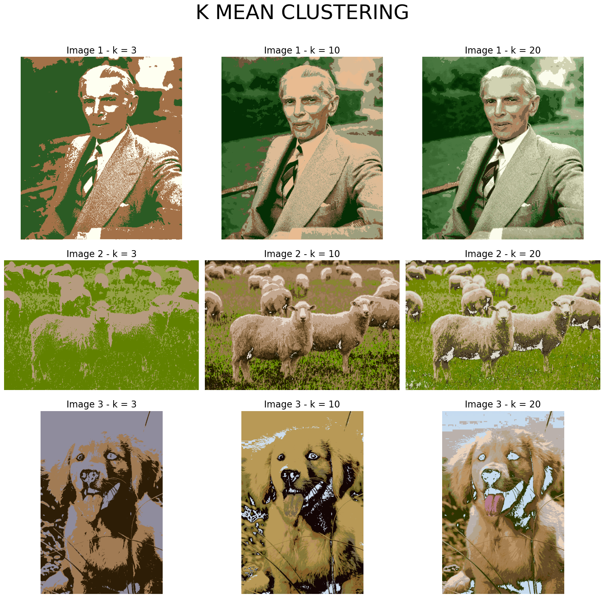

---

# **KMeans-Image-Processing** 🖼️📊

## **Description** 💡
Welcome to **KMeans-Image-Processing**, a Python project that applies the **K-Means clustering algorithm** to images for **color quantization** and **segmentation**. This project demonstrates how the **K-Means clustering** algorithm can be used to reduce the number of colors in images and segment them based on pixel similarity. By applying the algorithm with different values of **k** (3, 10, 20), you can observe how the clustering process affects the visual representation of images.

---

## **Features** 🌟
- **K-Means Clustering** applied to images for color segmentation and reduction.
- Demonstrates the impact of different **k** values (3, 10, 20) on the image clustering.
- Visualizes the images before and after clustering to compare the results.

---

## **Technologies Used** 🛠️
- **Python 3.x**
- **NumPy** for array operations
- **OpenCV** for image processing
- **Matplotlib** for visualization
- **Jupyter Notebook** for running the code and visualizing the results

---

## **Images Included** 🖼️
This project includes two key images demonstrating the K-Means clustering algorithm applied to various images. The images are:

1. **grid_kmean.png**: A grid showing the results of K-Means clustering applied to multiple images, with different values of `k` (3, 10, 20).
2. **parrots(random).png**: An image showing the parrots picture with random clustering applied at various values of `k` (2, 10, 20, etc.).

### **Example of K-Means Results:**

#### **Grid of K-Means Clustering Results**
The **grid_kmean.png** image shows the K-Means clustering results applied to multiple images. It provides a visual comparison of the effects of clustering with different values of `k` (3, 10, 20) on each image.



#### **Parrots Image with Random Clustering**
The **parrots(random).png** image shows how the parrots image looks after applying random K-Means clustering with different values of `k`. This demonstrates the effect of varying cluster sizes on the color reduction of the image.

.png)

---

## **Installation** 📥
To run this project on your local machine, follow these steps:

1. **Clone the repository**:
    ```bash
    git clone https://github.com/Bushra-Butt-17/KMeans-Image-Processing.git
    ```

2. **Navigate into the project directory**:
    ```bash
    cd KMeans-Image-Processing
    ```

3. **Install the required dependencies**:
    You can install the necessary libraries using **pip**:
    ```bash
    pip install -r requirements.txt
    ```

4. **Run the Jupyter Notebook**:
    After setting up the environment, run the notebook that processes and visualizes the images:
    ```bash
    jupyter notebook k_means_clustering.ipynb
    ```

---

## **How It Works** 🔍
### **K-Means Clustering Process:**

1. **Input**: The image is read and reshaped into a 2D array, where each row represents a pixel and each column represents the color channels (RGB).
2. **Centroid Initialization**: Random centroids are selected from the data points (pixels).
3. **Clustering**: The algorithm computes the distance (using Manhattan distance) between each pixel and each centroid, and assigns each pixel to the nearest centroid.
4. **Reconstruction**: The image is reconstructed with the centroids replacing the original pixel values.

The process is repeated for different values of **k** to show how the number of clusters affects the final result.

---

## **Contributing** 🤝
If you would like to contribute to this project, feel free to fork the repository and submit a pull request. Contributions are welcome to improve the functionality or add new features, such as:
- Adding more clustering algorithms.
- Improving image compression techniques.
- Implementing parallel processing for faster clustering.

---

## **License** 📜
This project is licensed under the MIT License - see the [LICENSE](LICENSE) file for details.

---

## **Contact** 📧
For any questions, feel free to open an issue.

---

## **Acknowledgments** 🙏
- Thanks to the creators of the libraries: **NumPy**, **Matplotlib**, **OpenCV**, and **scikit-learn**.
- Inspired by the concept of unsupervised learning and K-Means clustering in image processing.

---

