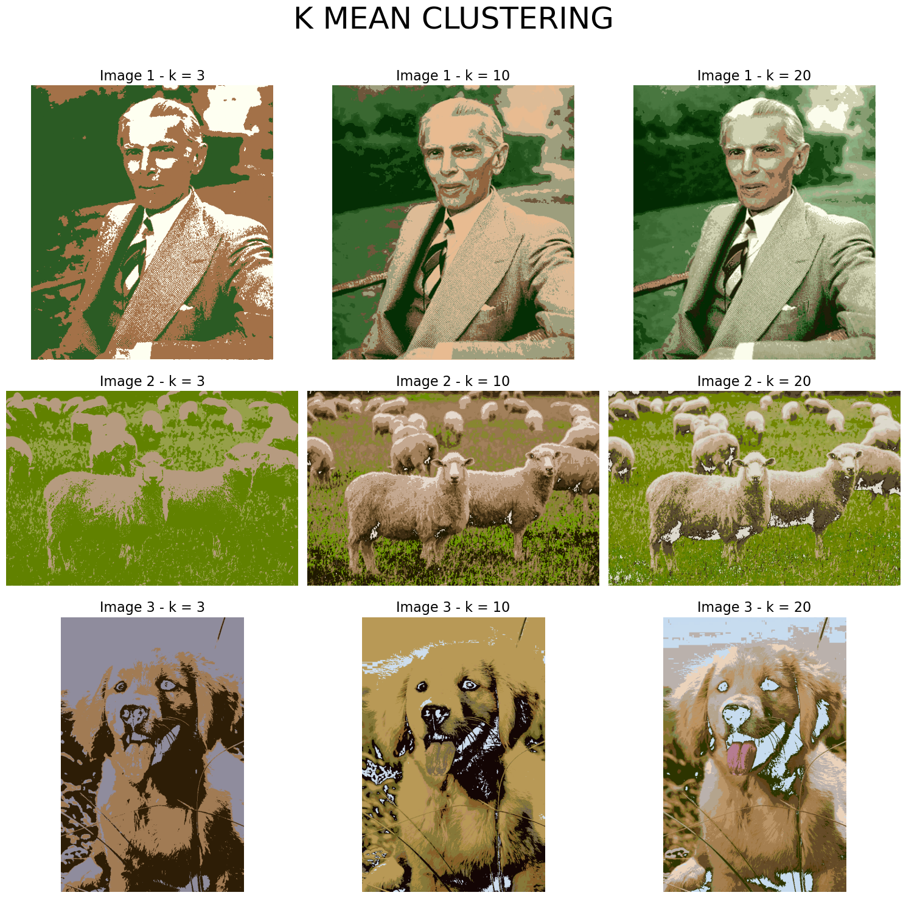

# **KMeans-Image-Processing** 🖼️📊  


Welcome to **KMeans-Image-Processing**, a Python-based project that applies the **K-Means clustering algorithm** to perform **color quantization** and **image segmentation**. By experimenting with various values of **k** (e.g., 3, 10, 20), this project demonstrates how clustering impacts the visual quality of images. This tool is ideal for exploring the power of unsupervised learning in image processing and achieving efficient image compression.

---

## **Table of Contents**  
1. [Description](#description)  
2. [Features](#features)  
3. [Technologies Used](#technologies-used)  
4. [Dataset and Visualization](#dataset-and-visualization)  
5. [How It Works](#how-it-works)  
6. [Installation](#installation)  
7. [Usage](#usage)  
8. [Contributing](#contributing)  
9. [License](#license)  
10. [Acknowledgments](#acknowledgments)  

---

## **Description** 💡  

This project focuses on implementing the **K-Means clustering algorithm** for **image processing** tasks such as:  

- **Color Quantization**: Reducing the number of colors in an image.  
- **Image Segmentation**: Grouping pixels based on color similarity.  

It showcases how changing the number of clusters (**k**) impacts the results. You can explore the effects of clustering with different values of **k** on sample images to understand the trade-offs between compression and image fidelity.

---

## **Features** 🌟  

- **K-Means Clustering** for image color quantization and segmentation.  
- Comparison of results with varying cluster sizes (`k = 3, 10, 20`).  
- Visual demonstrations of original vs. processed images for easy understanding.  
- Supports a variety of images for experimentation.  

---

## **Technologies Used** 🛠️  

The following technologies and libraries were used in this project:  

- **Python 3.x**: The programming language used for the project.  
- **NumPy**: For efficient numerical operations on arrays.  
- **OpenCV**: For image loading and preprocessing.  
- **Matplotlib**: For visualizing the clustering results.  
- **Jupyter Notebook**: For running and displaying the project in an interactive environment.  

---

## **Dataset and Visualization** 🖼️  

### **Included Images**  
Two images included in the repository showcase the effects of K-Means clustering:  

1. **grid_kmean.png**  
   Displays a grid of clustering results applied to multiple images, demonstrating how varying **k** values (3, 10, 20) affect image appearance.  

     

2. **parrots(random).png**  
   Displays clustering on a sample image of parrots with random **k** values (e.g., 2, 10, 20), showing how clustering impacts image segmentation.  

   .png)  

### **Visualization Example**  
Each processed image is compared side-by-side with its original version, enabling a clear understanding of the clustering effect.

---

## **How It Works** 🔍  

The **K-Means Clustering** algorithm is applied to images in the following steps:  

1. **Input Preprocessing**:  
   - Images are loaded using OpenCV and reshaped into a 2D array.  
   - Each row represents a pixel, and columns represent the RGB color channels.  

2. **Centroid Initialization**:  
   - Random centroids are selected from the pixel data points.  

3. **Clustering**:  
   - For each iteration, pixels are assigned to the nearest centroid based on **Manhattan Distance**.  
   - Centroids are updated to minimize the sum of squared distances (SSD).  

4. **Reconstruction**:  
   - Pixels are replaced with their assigned centroid values.  
   - The reconstructed image is displayed.  

5. **Comparison**:  
   - Results are visualized for different values of **k** (e.g., 3, 10, 20), highlighting the trade-off between simplicity and detail.  

---

## **Installation** 📥  

### **Step 1: Clone the Repository**  
```bash  
git clone https://github.com/Bushra-Butt-17/KMeans-Image-Processing.git  
```  

### **Step 2: Navigate to the Project Directory**  
```bash  
cd KMeans-Image-Processing  
```  

### **Step 3: Install Dependencies**  
Ensure you have Python 3.x installed, then run:  
```bash  
pip install -r requirements.txt  
```  

### **Step 4: Run the Notebook**  
Launch the Jupyter Notebook to explore and experiment:  
```bash  
jupyter notebook k_means_clustering.ipynb  
```  

---

## **Usage** ▶️  

1. Open the Jupyter Notebook file `k_means_clustering.ipynb`.  
2. Run the cells sequentially to:  
   - Load the images.  
   - Apply K-Means clustering with different values of **k**.  
   - Visualize the results.  

---

## **Contributing** 🤝  

We welcome contributions to enhance this project! Here’s how you can help:  

1. Fork the repository.  
2. Create a feature branch:  
   ```bash  
   git checkout -b feature-name  
   ```  
3. Commit your changes:  
   ```bash  
   git commit -m "Added new feature"  
   ```  
4. Push the branch to your forked repository:  
   ```bash  
   git push origin feature-name  
   ```  
5. Open a Pull Request and describe your feature or fix.  

### **Ideas for Contributions**:  
- Add support for more clustering algorithms.  
- Optimize the code for faster processing.  
- Add new visualization techniques.  

---

## **License** 📜  

This project is licensed under the **MIT License**. See the [LICENSE](LICENSE) file for full details.  

---

## **Acknowledgments** 🙏  

Special thanks to the following:  
- Developers of **NumPy**, **OpenCV**, **Matplotlib**, and **Jupyter Notebook**.  
- Researchers and data scientists exploring unsupervised learning techniques.  

---  

Let’s cluster some pixels! 🚀
